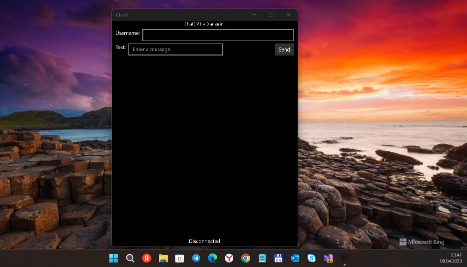

# ChatX

My experimental GhatGPT-like project based on PrivateAI api.

Warning: PrivateAI is privatedata-oriented version of ChatGPT... but it's also ChatGPT ;)

Free plan has some limits like 4 messegas per second & 75 messages per day. It's good for my little RnD.

## About 
A simple multi-platform implementation of a Xamarin.Forms AI app mixed with PrivateAI-based api. ;)

## Screenshots

## Tech. moments
### Min. Win. OS build SDK = 15063
### Solution's Architecture
- Client : ChatX shared project; ChatX.UWP, ChatX.Droid, ChatX.iOS target-dependant projects
- Server : https://private-ai.com

## How to ket your own api-key
See https://docs.private-ai.com/ (Get Started, etc.)
Get your API key and paste it at ChatGPT.cs.

## Ideas
- More powerful ChatGPT UI... because why not? =)
- Windows10Mobile ARM version? 

## ..
AS IS. No support. RnD only.

## .
[m][e] 2024

